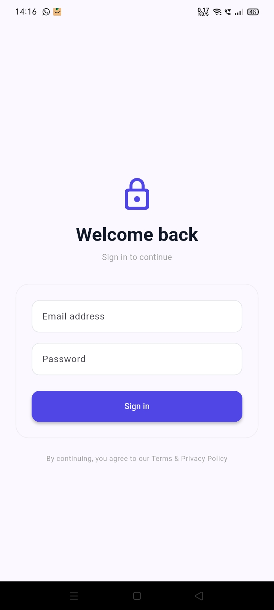
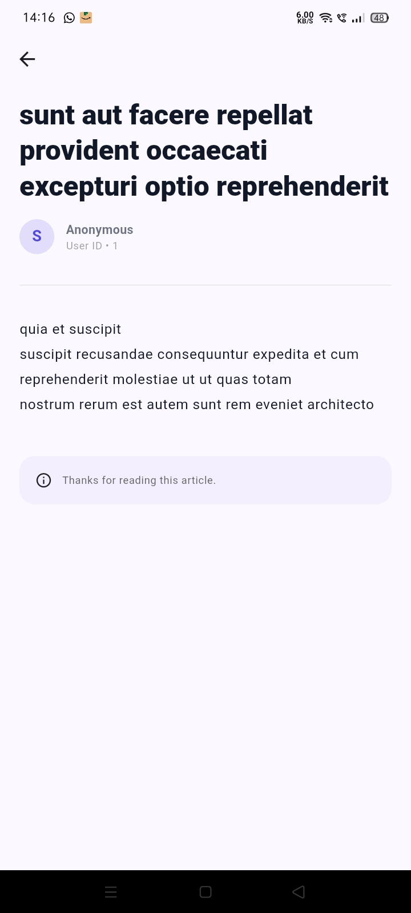

# Koders Assignment 

## Project Overview
A Flutter mobile application that consumes a public REST API, demonstrating structured code, efficient state management, and a polished user interface. It runs on both Android and iOS platforms.

## Features
- **Authentication Module**: Mock login with email/password validation and session handling (1-hour expiry).
- **API Integration**: Uses Dio for HTTP requests with proper response parsing.
- **Post List Screen**: Displays fetched data with pull-to-refresh functionality and shimmer loading effect.
- **Post Detail Screen**: Navigates to a detailed view of a selected post with data passing.
- **Form Validations**: Proper validations for email, password, and required fields.
- **State Handling**: Graceful handling of loading, empty, and error states across the UI.

## Technologies Used
-- **Flutter SDK**: 3.32.7 (stable)
- **Dart**: 3.8.1
- **State Management**: `flutter_bloc` for robust state management.
- **Networking**: `Dio` for making HTTP requests.
- **Local Storage**: `shared_preferences` for session management.
- **UI Effects**: `shimmer` package for attractive loading animations.
- **Dependency Injection**: `get_it` for managing dependencies.

## Architecture
This project follows a Clean Architecture pattern, aiming for separation of concerns and maintainability. It's structured into the following layers:
- **Data Layer**: Handles remote data sources (API calls) and data models.
- **Domain Layer**: Contains business logic, entities, and use cases.
- **Presentation Layer**: Manages UI, widgets, and BLoC state management.

## Installation and Setup

### Prerequisites
- Flutter SDK installed (version compatible with your project)
- Git

### Steps
1.  **Clone the repository:**
    ```bash
    git clone https://github.com/yourusername/koders_assignment.git
    cd koders_assignment
    ```
2.  **Install dependencies:**
    ```bash
    flutter pub get
    ```
3.  **Run the application:**
    ```bash
    flutter run
    ```
    (Ensure you have an Android emulator, iOS simulator, or a physical device connected and running.)

## Usage
- **Login:** Use any valid email format (e.g., `test@example.com`) and a password of at least 6 characters (e.g., `password123`) to log in. The session will expire after 1 hour.
- **Post List Screen:** The list displays posts fetched from an API. You can scroll down to load more posts (pagination) or pull down from the top to refresh the list.
- **Post Detail Screen:** Tap on any post item in the list to navigate to its detailed view.

##  Screenshots

| Login Screen                    | Post List Screen                     | Post Detail Screen                    |
|---------------------------------|--------------------------------------|---------------------------------------|
|  |  |  |


## License
This project is licensed under the MIT License.
